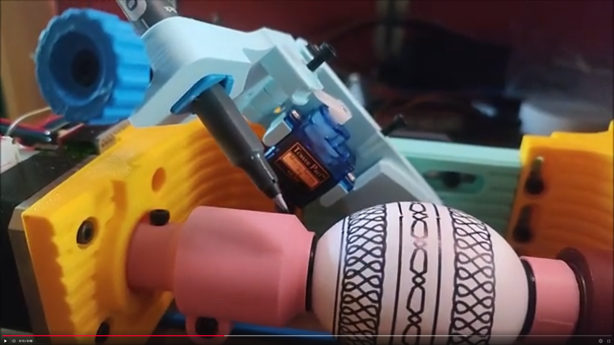

# grbl-servo with Z-axis control
A fork of [grbl-servo](https://github.com/vankesteren/grbl-servo) which can control the servo via a virtual Z-axis instead of the spindle commands.

I've created this fork specifically for a use in an eggbot/spherebot machine where the servo is used to lift the pen up and down. The servo is controlled by the Z-axis commands (`G0 Z1`, `G1 Z-1`, etc.) instead of the spindle commands (`M3`, `M5`, etc.). This way, the servo can not only be controlled by any G-code sender that supports the Z-axis but because the servi mirrors the Z-axis it performs all the movements smoothly and without and sudden jerks. This comes especially handy on a machine like the eggbot where the pen is lifted up and down frequently and we don't want to *smash* the pen into the egg and damage it's tip (or the egg itself :egg:).

See the [full diff](https://github.com/vankesteren/grbl-servo/compare/servo...misch2:grbl-servo:servo-on-z-axis) for more information.

Example video of the eggbot in action: https://www.youtube.com/watch?v=NwPCL7hVFCk
[](https://www.youtube.com/watch?v=NwPCL7hVFCk)

The following parameters can (and need) to be configured:


## Servo position relative to the virtual Z-axis

### SPINDLE_RPM_CONTROLLED_BY_Z_POS (`config.h`)
Set to 1 to enable the servo control via the Z-axis. When enabled, the servo will be controlled by the Z-axis commands (`G0 Z1`, `G1 Z-1`, etc.) instead of the spindle commands (`M3`, `M5`, etc.).
This is the main feature of this fork.

### Z_MM_FOR_MAX_SPINDLE_RPM (`config.h`)
The servo will be at the maximum (=down) position when the Z-axis is at this position. Value is in mm and defaults to -1.0 (i.e below the Z=0 position).

### Z_MM_FOR_MIN_SPINDLE_RPM (`config.h`)
The servo will be at the minimum (=up) position when the Z-axis is at this position. Value is in mm and defaults to 1.0 (i.e above the Z=0 position).


## Servo resolution

[This blog post](https://www.buildlog.net/blog/2017/08/using-grbls-spindle-pwm-to-control-a-servo/) explains very nicely how the servo can be used with the grbl firmware and what the limitations are. 

The main problem is that the only available timer has only 8 bit resolution which means that the servo can only be controlled in 256 steps but only like 1/10 of this range is really usable. This is a problem for the Z-axis control where the servo is used to lift the pen up and down. The pen should be lifted up and down smoothly and without any sudden jerks. But if there are only 16 steps between the 0 and 180 degree position of the servo, the pen will be lifted up and down in 11 degree steps which is not smooth at all.

I added a hack which uses 1/256 prescaler instead of the 1/64 prescaler which is used for the spindle control. This way, the servo can be controlled in 1024 steps which is much better. The downside is that it might not work for everyone (my cheap SG-90 servo is working fine with this though). We can now use 62 distinct servo positions within the 180 degrees range.


---

# `grbl-servo` README
`grbl-servo` can be used on Arduino to control an X-Y pen plotter, where the pen is operated by a small servo motor such as an SG90 micro servo.

This repository is a fork of [grbl](https://github.com/gnea/grbl) with support for a servo. It is different from the other `grbl-servo` repositories in that it is a proper fork: I will reapply the hacked-on servo control when `grbl` updates by rebasing the default `servo` branch based on the upstream `grbl/master`.


## Servo details
The main idea is to use the PWM signal normally used for spindle control in `grbl` to send a PWM signal to the servo for up/down motion. NB: the added servo functionality will only operate in 'non laser' ($32=0) mode

Connect the servo PWM signal input to the `Z-` or `Z+` pin on the Arduino CNC shield (or the `D11` pin on the arduino).

G-code to operate the servo
```gcode
M3 S255     (turn servo full on)
M5          (turn servo off)
M3          (turn servo full on)
M5          (turn servo off)
M3 S127     (turn servo half way)
M5          (turn servo off)
M3          (turn servo half way)
M5          (turn servo off)
```

The operating range of the servo depends on the PWM signal sent. By default, it sends pulses between ~0.5 and ~1.25 μs for a 45 degree angle between up (`M5` or `M3 S0`) and down (`M3 S255`) on my SG90 micro servo. You can edit the pulse width range in the file [`grbl/servo_control.c`](https://github.com/vankesteren/grbl-servo/blob/servo/grbl/spindle_control.c#L24).

## Edit details
The servo code was taken from commit [`21b4532`](https://github.com/lavolpecheprogramma/grbl-1-1h-servo/commit/21b45327887d228d65d967857ac77b6b883b34fc) on the [`grbl-1-1h-servo`]() repository by @lavolpecheprogramma based on work by @DWiskow, who in turn probably got their ideas from the [`grbl-servo`](https://github.com/robottini/grbl-servo) repo by @robottini (the code is very similar!).

---

# `grbl` README


***
_Click the `Release` tab to download pre-compiled `.hex` files or just [click here](https://github.com/gnea/grbl/releases)_
***
Grbl is a no-compromise, high performance, low cost alternative to parallel-port-based motion control for CNC milling. This version of Grbl runs on an Arduino with a 328p processor (Uno, Duemilanove, Nano, Micro, etc).

The controller is written in highly optimized C utilizing every clever feature of the AVR-chips to achieve precise timing and asynchronous operation. It is able to maintain up to 30kHz of stable, jitter free control pulses.

It accepts standards-compliant g-code and has been tested with the output of several CAM tools with no problems. Arcs, circles and helical motion are fully supported, as well as, all other primary g-code commands. Macro functions, variables, and most canned cycles are not supported, but we think GUIs can do a much better job at translating them into straight g-code anyhow.

Grbl includes full acceleration management with look ahead. That means the controller will look up to 16 motions into the future and plan its velocities ahead to deliver smooth acceleration and jerk-free cornering.

* [Licensing](https://github.com/gnea/grbl/wiki/Licensing): Grbl is free software, released under the GPLv3 license.

* For more information and help, check out our **[Wiki pages!](https://github.com/gnea/grbl/wiki)** If you find that the information is out-dated, please to help us keep it updated by editing it or notifying our community! Thanks!

* Lead Developer: Sungeun "Sonny" Jeon, Ph.D. (USA) aka @chamnit

* Built on the wonderful Grbl v0.6 (2011) firmware written by Simen Svale Skogsrud (Norway).

***

### Official Supporters of the Grbl CNC Project


***

## Update Summary for v1.1
- **IMPORTANT:** Your EEPROM will be wiped and restored with new settings. This is due to the addition of two new spindle speed '$' settings.

- **Real-time Overrides** : Alters the machine running state immediately with feed, rapid, spindle speed, spindle stop, and coolant toggle controls. This awesome new feature is common only on industrial machines, often used to optimize speeds and feeds while a job is running. Most hobby CNC's try to mimic this behavior, but usually have large amounts of lag. Grbl executes overrides in realtime and within tens of milliseconds.

- **Jogging Mode** : The new jogging commands are independent of the g-code parser, so that the parser state doesn't get altered and cause a potential crash if not restored properly. Documentation is included on how this works and how it can be used to control your machine via a joystick or rotary dial with a low-latency, satisfying response.

- **Laser Mode** : The new "laser" mode will cause Grbl to move continuously through consecutive G1, G2, and G3 commands with spindle speed changes. When "laser" mode is disabled, Grbl will instead come to a stop to ensure a spindle comes up to speed properly. Spindle speed overrides also work with laser mode so you can tweak the laser power, if you need to during the job. Switch between "laser" mode and "normal" mode via a `$` setting.

	- **Dynamic Laser Power Scaling with Speed** : If your machine has low accelerations, Grbl will automagically scale the laser power based on how fast Grbl is traveling, so you won't have burnt corners when your CNC has to make a turn! Enabled by the `M4` spindle CCW command when laser mode is enabled!

- **Sleep Mode** : Grbl may now be put to "sleep" via a `$SLP` command. This will disable everything, including the stepper drivers. Nice to have when you are leaving your machine unattended and want to power down everything automatically. Only a reset exits the sleep state.

- **Significant Interface Improvements**: Tweaked to increase overall performance, include lots more real-time data, and to simplify maintaining and writing GUIs. Based on direct feedback from multiple GUI developers and bench performance testing. _NOTE: GUIs need to specifically update their code to be compatible with v1.1 and later._

	- **New Status Reports**: To account for the additional override data, status reports have been tweaked to cram more data into it, while still being smaller than before. Documentation is included, outlining how it has been changed. 
	- **Improved Error/Alarm Feedback** : All Grbl error and alarm messages have been changed to providing a code. Each code is associated with a specific problem, so users will know exactly what is wrong without having to guess. Documentation and an easy to parse CSV is included in the repo.
	- **Extended-ASCII realtime commands** : All overrides and future real-time commands are defined in the extended-ASCII character space. Unfortunately not easily type-able on a keyboard, but helps prevent accidental commands from a g-code file having these characters and gives lots of space for future expansion.
	- **Message Prefixes** : Every message type from Grbl has a unique prefix to help GUIs immediately determine what the message is and parse it accordingly without having to know context. The prior interface had several instances of GUIs having to figure out the meaning of a message, which made everything more complicated than it needed to be.

- New OEM specific features, such as safety door parking, single configuration file build option, EEPROM restrictions and restoring controls, and storing product data information.
 
- New safety door parking motion as a compile-option. Grbl will retract, disable the spindle/coolant, and park near Z max. When resumed, it will perform these task in reverse order and continue the program. Highly configurable, even to add more than one parking motion. See config.h for details.

- New '$' Grbl settings for max and min spindle rpm. Allows for tweaking the PWM output to more closely match true spindle rpm. When max rpm is set to zero or less than min rpm, the PWM pin D11 will act like a simple enable on/off output.

- Updated G28 and G30 behavior from NIST to LinuxCNC g-code description. In short, if a intermediate motion is specified, only the axes specified will move to the stored coordinates, not all axes as before.

- Lots of minor bug fixes and refactoring to make the code more efficient and flexible.

- **NOTE:** Arduino Mega2560 support has been moved to an active, official Grbl-Mega [project](http://www.github.com/gnea/grbl-Mega/). All new developments here and there will be synced when it makes sense to.


```
List of Supported G-Codes in Grbl v1.1:
  - Non-Modal Commands: G4, G10L2, G10L20, G28, G30, G28.1, G30.1, G53, G92, G92.1
  - Motion Modes: G0, G1, G2, G3, G38.2, G38.3, G38.4, G38.5, G80
  - Feed Rate Modes: G93, G94
  - Unit Modes: G20, G21
  - Distance Modes: G90, G91
  - Arc IJK Distance Modes: G91.1
  - Plane Select Modes: G17, G18, G19
  - Tool Length Offset Modes: G43.1, G49
  - Cutter Compensation Modes: G40
  - Coordinate System Modes: G54, G55, G56, G57, G58, G59
  - Control Modes: G61
  - Program Flow: M0, M1, M2, M30*
  - Coolant Control: M7*, M8, M9
  - Spindle Control: M3, M4, M5
  - Valid Non-Command Words: F, I, J, K, L, N, P, R, S, T, X, Y, Z
```
